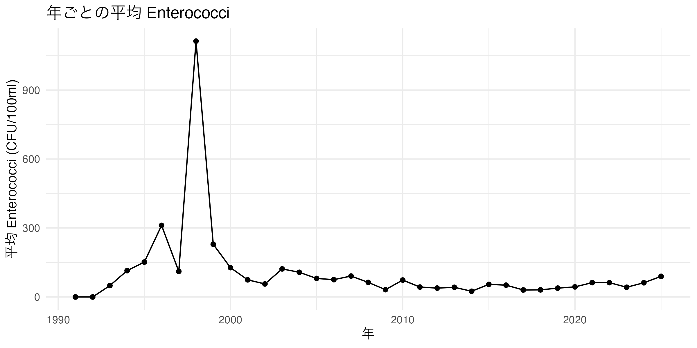
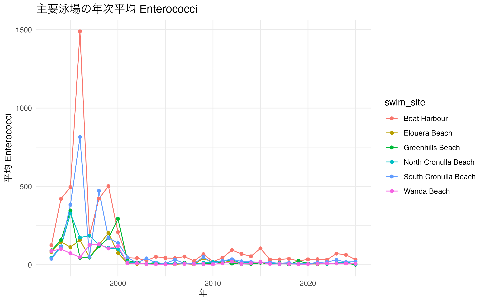
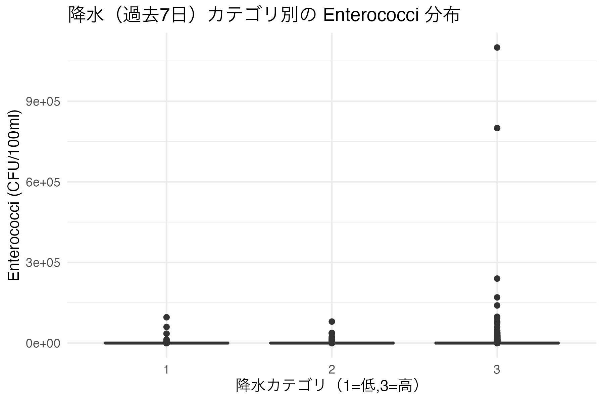
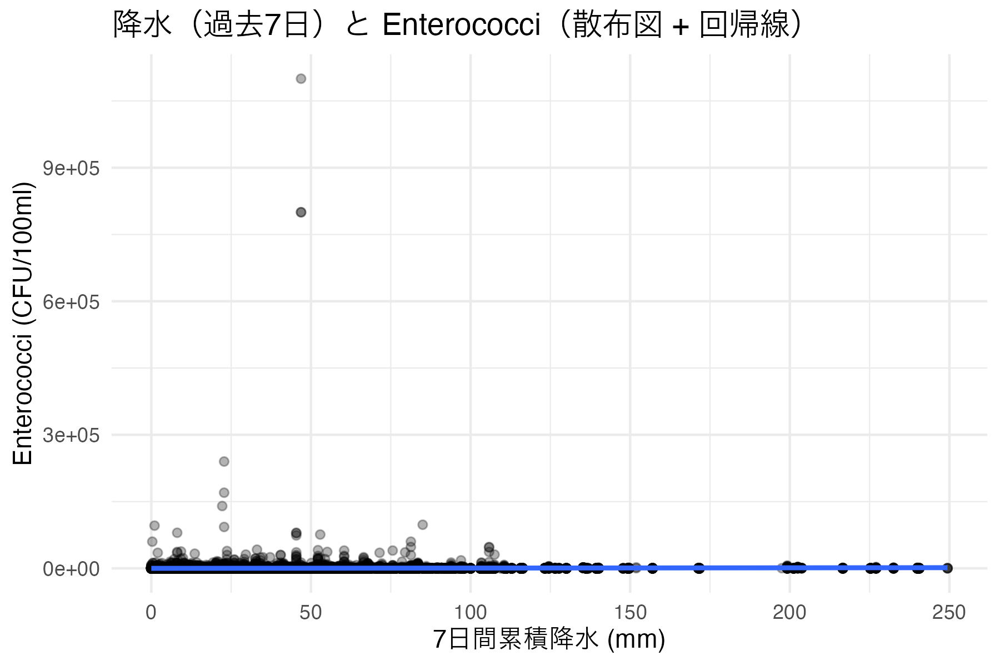

```{r setup, include=FALSE}
# コードと出力メッセージをレポートに表示しない設定
knitr::opts_chunk$set(echo = FALSE, message = FALSE, warning = FALSE)
# 非表示で解析スクリプトを実行（scripts/analysis_for_quarto.R を project ルートから参照）
source("scripts/analysis_for_quarto.R")
```

# はじめに

データセットについて: このレポートはシドニー周辺の海水中の Enterococci（腸球菌）測定値を用いた解析です。データ出所: 本解析で使用した水質データ（Enterococci）および気象データは、TidyTuesday の 2025-05-20 公開データセットから取得しました（ファイル: water_quality.csv, weather.csv）。解析スクリプト scripts/analysis_for_quarto.R は以下の URL から生データを読み込みます（取得日: 2026-05-24）：

- https://raw.githubusercontent.com/rfordatascience/tidytuesday/main/data/2025/2025-05-20/water_quality.csv
- https://raw.githubusercontent.com/rfordatascience/tidytuesday/main/data/2025/2025-05-20/weather.csv

元データの出典・ライセンス等の詳細は TidyTuesday の該当ページ（https://github.com/rfordatascience/tidytuesday/tree/main/data/2025/2025-05-20）を参照してください。

解析で答えたい問い:

- この地域・主要泳場における年次傾向はどうか
- 降水や直近の降雨が Enterococci 濃度に与える影響はあるか
- 特定の地点で関心すべきパターン（高いリスクの日など）は存在するか

可視化について: 変数間の関係を示す図を少なくとも 2 点含めます（例: 降水量 vs Enterococci、主要サイトの年次推移）。各図の下に簡潔な考察を付記してください。

このファイルは RStudio で開いて編集できます。

# 概要
以下は非表示の解析スクリプトにより作成された図表と自動生成メッセージです。

## 可視化

### 1) 年次傾向（図1）

{width=80%}

図1: 各年の Enterococci 平均値の推移。

図1から読み取れること（簡潔でわかりやすく）:

- 年平均が継続的に「上がっている」なら、水質が悪化している可能性がある。
- ある年だけ極端に高い場合は、その年に起きた大雨や測定条件の変化が原因かもしれない。
- スクリプトの自動メッセージ（検定結果）も合わせて確認する。

### 2) 主要泳場の年次推移（図2）

{width=80%}

図2: 主要サイトごとの年次平均の比較。

図2から読み取れること（簡潔でわかりやすく）:

- 常に値が高いサイトは、現地の汚染源や排水の影響を受けている可能性が高く、優先的に調査すべき。
- サイトごとの違いは、対策や監視頻度を決める参考になる。

### 3) 降水と Enterococci（図3・図4）

{width=60%}

図3: 降水カテゴリ別の Enterococci 分布。

図3から読み取れること（簡潔でわかりやすく）:

- 高い降水カテゴリで中央値が大きければ、降雨後に菌濃度が上がる傾向があると考えられる。
- 箱ひげ図の重なりが大きい場合は、降雨だけで説明できない要因があるかもしれない。

{width=60%}

図4: 7日累積降水量と Enterococci の散布図（回帰線あり）。

図4から読み取れること（簡潔でわかりやすく）:

- 点が右上に集まる傾向（回帰線が右上がり）なら、降水増加と菌濃度上昇の関連が示唆される。
- 自動メッセージの相関検定結果で「有意かどうか」を確認する。異常値が結果を歪めていないかもチェックする。

## 自動生成メッセージ（解析の要点）

```{r}
# 自動生成メッセージを読み込んで表示
msgs <- readr::read_csv("outputs/report_messages.csv", show_col_types = FALSE)
cat(paste0("- ", msgs$item, ": ", msgs$text), sep = "\n\n")
```


---

## 考察 — 主要な問いへの明確な回答（専門用語少なめ）

以下は、図と自動生成メッセージをもとに、専門用語をなるべく使わずに簡潔に答えたものです。

```{r}
msgs <- readr::read_csv('outputs/report_messages.csv', show_col_types = FALSE)
get_text <- function(key) {
  t <- msgs$text[msgs$item == key]
  if (length(t) == 0) return(NA_character_)
  t
}

year_txt <- get_text('year_message')
precip_txt <- get_text('precip_message')
site_txt <- get_text('site_message')

simplify_year <- function(txt) {
  if (is.na(txt)) return('データが不足しており、年ごとの傾向を判断できません。')
  if (grepl('有意に増加', txt)) return('結論: 年平均は増えています。')
  if (grepl('有意に減少', txt)) return('結論: 年平均は減っています。')
  return('結論: 年ごとの明確な増減は見られません。')
}

simplify_precip <- function(txt) {
  if (is.na(txt)) return('データが不足しており、降水の影響を判断できません。')
  if (grepl('有意な相関', txt)) return('結論: 降雨が増えると菌濃度が上がる傾向が示されました。')
  if (grepl('相関は弱い|有意ではありません', txt)) return('結論: 降雨と菌濃度の関係ははっきりしません。')
  return('結論: 降雨と菌濃度の関係は明確ではありません。')
}

simplify_site <- function(txt) {
  if (is.na(txt)) return('データが不足しており、特定サイトの評価ができません。')
  if (grepl('増加傾向が大きいサイト', txt)) {
    sites <- sub('.*: ?', '', txt)
    return(paste0('結論: 次のサイトで増加傾向が見られます — ', sites, '。これらは優先的に調査してください。'))
  }
  if (grepl('十分なデータのあるサイトがありません', txt)) return('結論: 十分なデータのあるサイトがなく、特定できません。')
  return(txt)
}

cat(simplify_year(year_txt), '\n\n')
cat(simplify_precip(precip_txt), '\n\n')
cat(simplify_site(site_txt), '\n\n')

# 短くわかりやすい今後の提案
cat('簡単な提案:\n')
cat('- 監視: 降雨直後と、上で挙がった優先サイトを重点的に観測する。\n')
cat('- 調査: 優先サイトで現地調査を行い、流入源や排水の情報を確認する。\n')
cat('- 追加解析: 必要なら詳しい統計解析（回帰など）を行い、より確かな結論を得る。\n')
```

<p style="font-size:90%; color:gray;">注: 上の簡易結論は図と自動生成メッセージを要約したものです。元データと図を合わせて最終判断してください。</p>
<p style="font-size:90%; color:gray;">注: 図からの解釈は観察的であり、因果関係は主張できません。必要に応じて追加解析を行ってください。</p>
